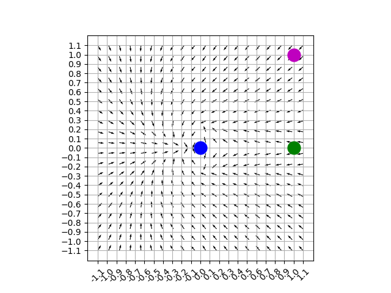
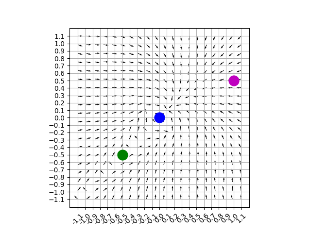

# Pushing with turtlebot3
Hi there, this is our final project for CS4341(Introduction to AI @WPI).
This project is built upon the tutorial provided on the turtlebot3's ROBOTIS [e-Manual](https://emanual.robotis.com/docs/en/platform/turtlebot3/machine_learning/#machine-learning).

In the simple navigation of a robot between two locations, traditional kinematic models may be sufficient for most cases.
This approach may not do so well in cases where a robot is so close to the target position and needs to make a quick correction.
In this case, an ML-based approach might come to rescue.
The tutorial provided above steers the robot with a constant speed to a randomly picked goal position.

## Methodology
Our application defines a free cylindrical object in the world and has the robot push it towards a random goal position.
Achieving this using traditional robot kinematics is not as trivial as having the robot itself move to the goal.
This is because, now, the robot needs to push the object from behind and, if it loses the contact with the object, has to re-position itself to be pushing again.
To steer the robot behind the object and push it towards a goal position, the reward function was modified to produce the following suggested heading vector fields.



Figure 1: The field vector graph of the desired heading angle based on cylinder obstacle position plotted blue at (0, 0), goal position plotted green at (1, 0), and robot position(all the vectors represent a robot position, but to give an example of where the robot could be, a pink dot at (1, 1) was plotted).



Figure 2: The field vector graph of the desired heading angle based on cylinder obstacle position plotted blue at (0, 0), goal position plotted green at (-0.5, 0.5), and robot position(all the vectors represent a robot position, but to give an example of where the robot could be, a pink dot at (1, 0.5) was plotted).

The position of the robot is determined through its LIDAR and the position of the cylindrical object is polled from gazebo. 

## Results
For the whole training process(16x): click [here](https://youtu.be/sYeYrgIsD40).

For the best scoring episode: click [here](https://youtu.be/sYeYrgIsD40?t=1930).

## Running Instructions
In order to run this, you need to have ROS, Gazebo, turtlebot and other ML dependencies installed in your system. For this, you can follow [this](https://emanual.robotis.com/docs/en/platform/turtlebot3/machine_learning/#machine-learning) tutorial.

After making/compiling the two packages with catkin_make, here are the instructions to run it:

1. On one terminal, run below:

```
$ roslaunch turtlebot3_gazebo turtlebot3_stage_cs4341.launch
```

2. On another terminal, run below:

```
$ roslaunch turtlebot3_dqn turtlebot3_dqn_stage_cs4341.launch
```

3. On another terminal, run below:

```
$ roslaunch turtlebot3_dqn result_graph.launch
```

## Acknowledgments
I extend thanks to my CS4341 lab partners Timothy Klein and Liam Jennings for their contributions to the four main projects and on the report.
Additionally, I found the ROBOTIS' documentation on turtlebot3 very helpful.

